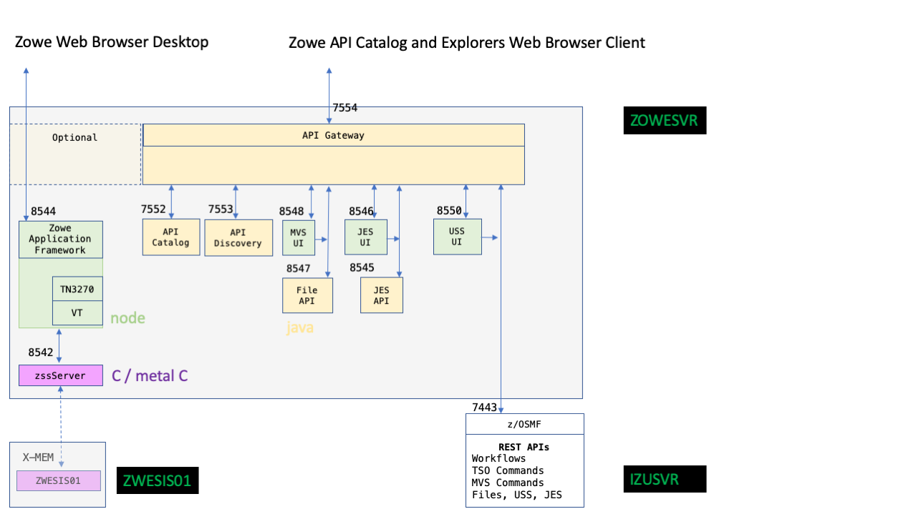

# Zowe architecture

Zowe&trade; is a collection of components that together form a framework that allows Z based functionality to be accessible across an organization. This includes exposing Z based components such as z/OSMF as Rest APIs. The framework provides an environment where other components can be included and exposed to a broader non-Z based audience.

Zowe is divided into two main parts. 

**z/OS Compoments**  

 There are a number of z/OS components that are installed on z/OS and provide the runtime functionality for the API Mediation Layer, the Zowe Application Framework and the Zowe z/OS Services.  These are delivered in two installation formats
 
- A convenience build created by the Zowe community when a release milestone is reached.  This is delivered as a .pax file that can be installed on z/OS unix system services together with a SAMPLIB and LOADLIB.  

- An SMP/E distribution that is the same software that is included in the convenience build, but delivered as an FMID.

The SMP/E distribution is able to have maintenance applied through SMP/E where each convenience build on top of the initial FMID is delivered as a PTF release.

 **Command Line Interface components**  

 The command line interface runs on any computer that supports node, typically a desktop that has connectivity to a z/OS machine.  The command line interface provides a scriptable interface to z/OS functionality that can be extended through plugins.

**There is no dependency between the z/OS Components and the Command Line Interface components**

A Zowe user can install the CLI on their PC and configure it to connect to a z/OS that does not have any of the Zowe z/OS components installed.

A Zowe user can install the z/OS components on their z/OS machine and configure and launch the API mediation layer, the Zowe Application Desktop or the Zowe z/OS components.  They can connect their PC web browser to the desktop provided in the Zowe Application Desktop, or connect their PC web browser to the API catalog that shows the Zowe z/OS services as well as other z/OS services.  A Zowe user building applications that extend or use the Zowe z/OS services are able to program to the REST APIs or the Application Desktop plugin mechanism or the API mediation layer extension model without installing the Zowe CLI on their desktop.

**Zowe On Premise Architecture for z/OS Components**

The z/OS components for Zowe run as two started tasks.  The first of these is `ZOWESVR`.  This forms the bulk of the Zowe runtime and contains the two most important subsystems, the Zowe Application Framework and the API Gateway.  These are shown in Figure 1.  The `ZOWESVR` started task has a number of address spaces as shown in Figure 1.  The names of the address spaces can be configured as described in [Address space name](../user-guide/configure-zowe-runtime.md#configuration-variables)

The second of these is `ZWESIS01` that perfofrms tasks on behalf of the Zowe desktop that require running under APF authorized priviledges.

A third important part of Zowe is the z/OSMF started task `IZUSVR1` that is included with z/OS.  This is used to provide REST APIs to a number of the Zowe services.

***Figure 1***

 

***Component architecture***

The Zowe [API Mediation Layer](./overview.md#api-mediation-layer) is made up of three microservices - the API Gateway, the API catalog and the API discovery.  These are all written in Java and are Apache Tomcat servers.  The API gateway is a reverse proxy server that mediates between clients on its northbound edge (such as web pages) and servers on its southbound edge (such as REST APIs served by z/OSMF or web pages from UI servers).  The proxy provides a single endpoint host and port to simplify certificate acceptance from the client as well as the ability to support single sign on (one password challenge for the end user).  The default port for the API gateway is 7554 although [this can be configured](../user-guide/configure-zowe-runtime.md#configuration-variables) at install time.  

